# PowPaw

## Relazione per il progetto del corso di Programmazione ad Oggetti 2022/23

**Creatori**:

- Alessia Carfì
  - alessia.carfi@studio.unibo.it
- Giacomo Grassetti
  - giacomo.grassetti@studio.unibo.it
- Simone Collorà
  - simone.collora@studio.unibo.it

**Indice**:

- [Analisi](#analisi)
  - [Requisiti funzionali](#requisiti-funzionali)
  - [Requisiti non funzionali](#requisiti-non-funzionali)
  - [Analisi e modello del dominio](#analisi-e-modello-del-dominio)
- [Design](#design)
  - [Architettura](#architettura)
  - [Design dettagliato](#design-dettagliato)
    - [Alessia Carfì](#alessia-carfì)
      - [Gestione del movimento 2D](#gestione-del-movimento-2d)
      - [Gestione delle hitbox](#gestione-delle-hitbox)
      - [Gestire l'aggiornamento dello sprite del personaggio](#gestire-l'aggiornamento-dello-sprite-del-personaggio)
      - [Gestione dei comandi di gioco](#gestione-dei-comandi-di-gioco)
      - [Comandi fluidi e reattivi](#comandi-fluidi-e-reattivi)
    - [Giacomo Grassetti](#giacomo-grassetti)
      - [Creazione delle entità (Model)](<#creazione-delle-entità-(model)>)
      - [Armi:](#armi:)
      - [Blocchi](#blocchi)
      - [Creazione della mappa di gioco](#creazione-della-mappa-di-gioco)
      - [Fisica delle entità](#fisica-delle-entità)
      - [Hitbox Armi](#hitbox-armi)
      - [Hitbox Blocchi](#hitbox-blocchi)
      - [Hitbox braccio del player](#hitbox-braccio-del-player)
        - [Gestione delle collisioni](#gestione-delle-collisioni)
      - [Controllo delle entità (Controller)](<#controllo-delle-entità-(controller)>)
        - [Gestione della morte](#gestione-della-morte)
      - [Render delle entità (View)](<#render-delle-entità-(view)>)
    - [Simone Collorà](#simone-collorà)
      - [Gestione PowerUp](#gestione-powerup)
      - [Gestione stati di gioco](#gestione-stati-di-gioco)
      - [Gestione statistiche:](#gestione-statistiche)
      - [Gestione Dannometro:](#gestione-dannometro)
- [Sviluppo](#sviluppo)
  - [Testing automatizzato](#testing-automatizzato)
  - [Simone Collorà](#simone-collorà)
  - [Simone Collorà](#simone-collorà)
- [Commenti finali](#commenti-finali)
  - [Autovalutazione e lavori futuri](#autovalutazione-e-lavori-futuri)
    - [Alessia Carfì](#alessia-carfì)
    - [Giacomo Grassetti](#giacomo-grassetti)
    - [Simone Collorà](#simone-collorà)
  - [Difficoltà incontrate e commenti per i docenti](#difficoltà-incontrate-e-commenti-per-i-docenti)
    - [Alessia Carfì](#alessia-carfì)
    - [Giacomo Grassetti](#giacomo-grassetti)
    - [Simone Collorà](#simone-collorà)
- [Esercitazioni di laboratorio](#esercitazioni-di-laboratorio)

Il progetto consiste nel creare un **Platform Fighting Game** in stile _Super Smash Bros_ o _Brawlhalla_. Lo scopo del gioco è battere il tuo avversario in una battaglia `1 vs 1`.

## Analisi

### Requisiti funzionali

- Prima del combattimento si avrà la possibilità di personalizzare le statistiche del proprio personaggio giocabile; nello specifico il personaggio avrà dei _punti statistica_ di base e dei _punti statistica aggiuntivi_ da potere sommare a quest'ultime a proprio piacimento.
- Durante la battaglia, cadranno _armi_ e _powerup_ dall'alto e ogni giocatore potrà raccoglierli e usarli oppure combattere a mani nude al fine di mandare l'avversario fuori dall'area di gioco.

### Requisiti non funzionali

- Il gioco dovrà essere molto efficiente nell'utilizzo dei comandi; non deve esserci nessun ritardo tra la pressione di un tasto e l'effettiva esecuzione del comando nel gioco.

### Analisi e modello del dominio

I personaggi dovranno essere personalizzati prima dell'inizio di ogni partita. Una volta creati, dovranno essere in grado di muoversi sulla piattaforma con un movimento 2D che gli possa permettere un movimento a destra e a sinistra, di salvare e schivare. Ogni _player_ sarà in grado di colpire l'avversario e di raccogliere e utilizzare le _armi_ e i _powerup_ caduti dall'alto fino a che uno dei due player verrà sconfitto.

Gli aspetti più impegnativi sono:

- la gestione del movimento,
- le collisioni tra i personaggi e gli attacchi.

In particolare, è necessario assicurarsi che i personaggi si muovano fluidamente sulla piattaforma, interagiscano correttamente con gli oggetti di gioco e rispondano correttamente ai comandi dei giocatori.

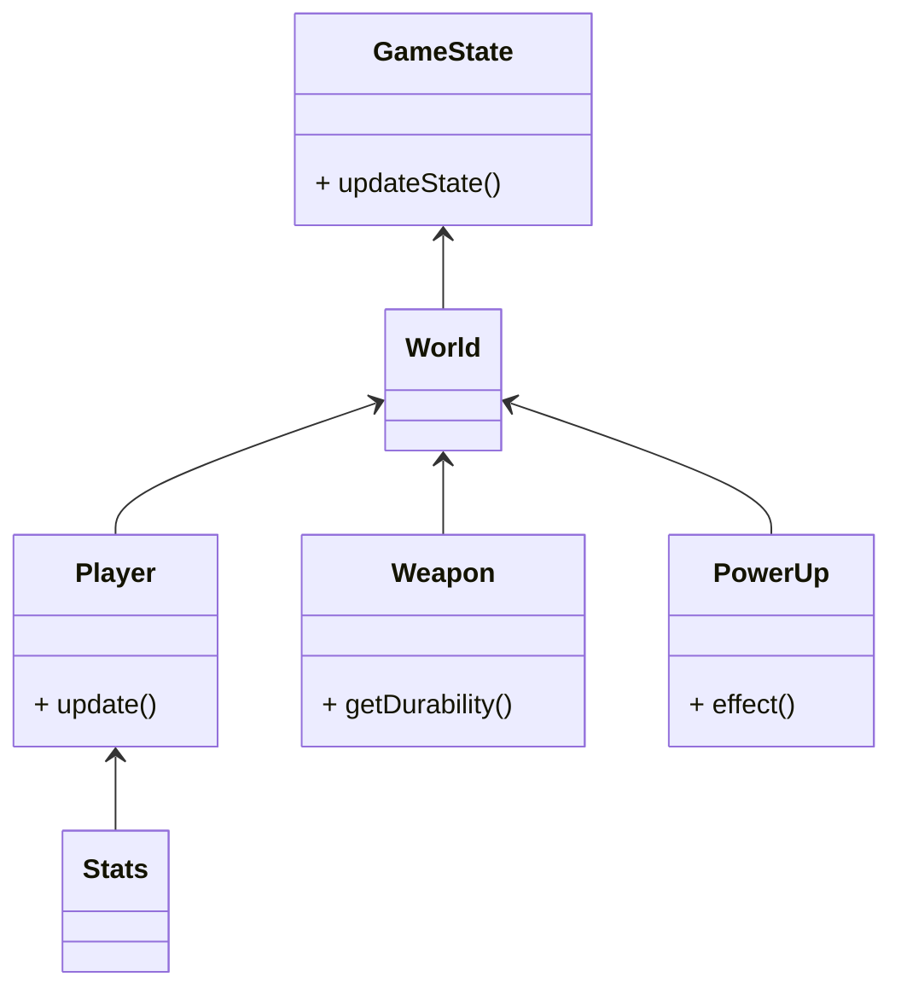
```mermaid
classDiagram
	Player <-- Stats
	World <-- Player
	World <-- Weapon
	World <-- PowerUp
	GameState <-- World

	class Player{
	+ update()
	}

	class Weapon{
	+ getDurability()
	}

	class PowerUp{
	+ effect()
	}

	class GameState{
	+ updateState()
	}
```

## Design

### Architettura

PowPaw segue il **pattern MVC**. Ogni _entità_ nel gioco, ha una sua parte di **Model**, di **View** e di **Controller**:

- **Model**:
  - Il model del player contiene tutti i metodi che gestiscono il movimento 2D e la gestione degli attacchi (quindi quando e come può attaccare).
  - Il model del DamageMeter gestisce il danno e il suo aumento
  - Il model del PowerUp crea un cerchio. Questo verrà creato come PowerUp di attacco o velocità randomicamente
  - contiene le statistiche che saranno buildate tramite una classe builder
  - Il model dei blocchi per terreno di gioco contiene tutti i metodi e le proprietà che consento di settera la posizione dell'entità nella mappa di gioco
  - Il model delle armi contiene le proprietà e i metodi necessari per la creazione di tale entità e per settare le posizioni randomica di spawn all'interno dell'area di gioco.
- **View**:
  - Nella view invece ci sono i metodi che si occupano di renderizzare graficamente il player nel mondo e di scegliere lo sprite giusto a seconda del player e di come quest'ultimo si sta interfacciando col mondo di gioco.
  - Inoltre è sempre la view che si occupa di prendere in input i tasti della tastiera per i comandi di gioco.
  - Nella view sono presenti i menù start, statistiche e gameover
  - Si occupa di renderizzare i PowerUp
  - Nella view l'utente può aumentare o diminuire le statistiche di entrambi i player a piacimento con un menù a video
- **Controller**:
  - Il controller invece si occupa di fare comunicare la view con il model; In particolare di istanziare il player nelle loro posizioni iniziali e di fare arrivare tutte le posizioni successive del player alla view in modo da potere renderizzare gli sprite di conseguenza.
  - si occupa anche di stabilire quali sono i comandi che possono usare i due giocatori e, ad ogni tasto premuto, vengono richiamati i metodi del model.
  - gestisce il render del damage
  - gestisce il PowerUp e controlla se un PowerUp è raccolto da un player.
  - gestisce l'aumento o la diminuzione di una statistica
  - il controller delle armi (chiamate da ora Weapon) si occupa di gestire la specifica entità Weapon quali la modifica della sua posizione, se viene raccolta e (o meno) usata dal player
  - È stato creato un controller aggiuntivo che non possiede un'entità, o meglio, che si riferisce alla gestione degli attacchi dati da un giocatore verso l'avversario. Gestisce se un player viene o meno colpito, e se finisce fuori dall'area di gioco.

**Player**:

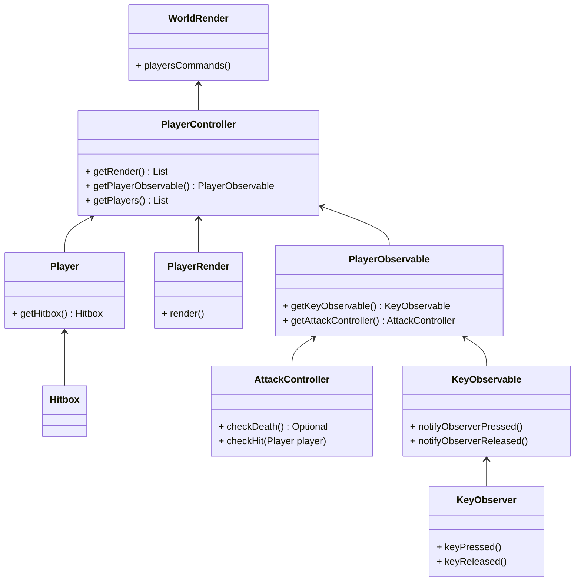
```mermaid
classDiagram

Player <-- Hitbox

PlayerController <-- Player

PlayerController <-- PlayerRender

WorldRender <-- PlayerController

PlayerController <-- PlayerObservable

PlayerObservable <-- AttackController

PlayerObservable <-- KeyObservable

KeyObservable <-- KeyObserver


class Player{

+ getHitbox() Hitbox

}

class PlayerController{

+ getRender() List<PlayerRender>

+ getPlayerObservable() PlayerObservable

+ getPlayers() List<Player>

}

class WorldRender{

+ playersCommands()

}

class AttackController{

+ checkDeath() Optional<Player>

+ checkHit(Player player)

}

class KeyObserver{

+ keyPressed()

+ keyReleased()

}

class KeyObservable{

+ notifyObserverPressed()

+ notifyObserverReleased()

}

class PlayerObservable{

+ getKeyObservable() KeyObservable

+ getAttackController() AttackController

}

class PlayerRender{

+ render()

}
```

**Weapon**:

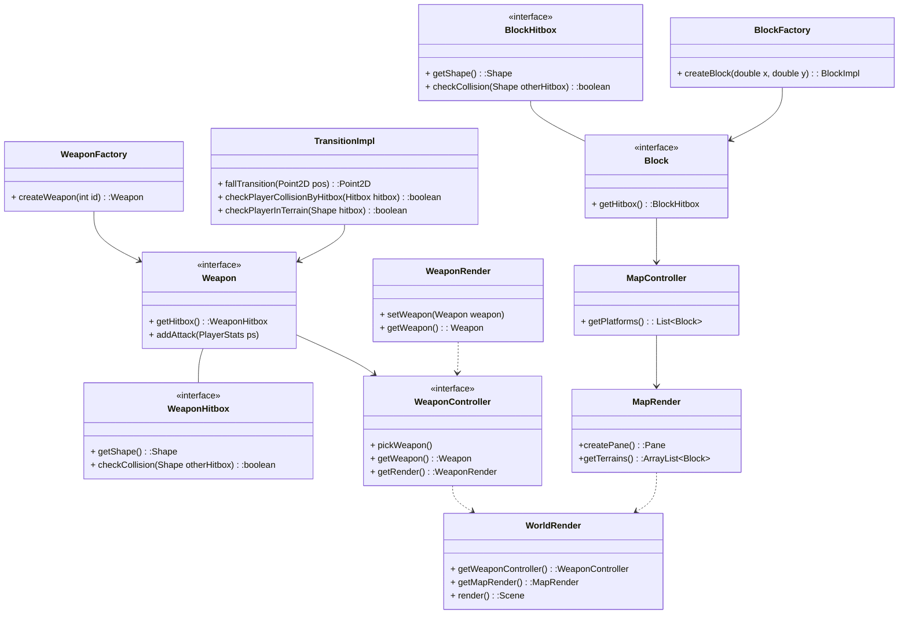
```mermaid
classDiagram
    BlockHitbox -- Block
    BlockFactory --> Block
    Weapon -- WeaponHitbox
    WeaponFactory --> Weapon

    class BlockHitbox{
    <<interface>>
        + getShape():Shape
        + checkCollision(Shape otherHitbox):boolean
    }
    class Block{
    <<interface>>
        + getHitbox():BlockHitbox
    }
    class BlockFactory{
        + createBlock(double x, double y): BlockImpl
    }


    Block --> MapController
    MapController --> MapRender
    class MapController{
        + getPlatforms(): List~Block~
    }


    class Weapon{
    <<interface>>
        + getHitbox():WeaponHitbox
        + addAttack(PlayerStats ps)
    }
    class WeaponHitbox{
    <<interface>>
        + getShape():Shape
        + checkCollision(Shape otherHitbox):boolean
    }
    class WeaponFactory{
        + createWeapon(int id):Weapon
    }

    Weapon --> WeaponController
    class WeaponController{
    <<interface>>
        + pickWeapon()
        + getWeapon():Weapon
        + getRender():WeaponRender
    }
    class TransitionImpl{
        + fallTransition(Point2D pos):Point2D
        + checkPlayerCollisionByHitbox(Hitbox hitbox):boolean
        + checkPlayerInTerrain(Shape hitbox):boolean
    }

    WeaponRender ..> WeaponController
    WeaponController ..>WorldRender
    TransitionImpl --> Weapon
    MapRender ..>WorldRender

    class MapRender{
        +createPane():Pane
        +getTerrains():ArrayList~Block~
    }
    class WorldRender{
        + getWeaponController():WeaponController
        + getMapRender():MapRender
        + render():Scene
    }
    class WeaponRender {
        + setWeapon(Weapon weapon)
        + getWeapon() : Weapon
    }
```

**Statistics and PowerUp**:

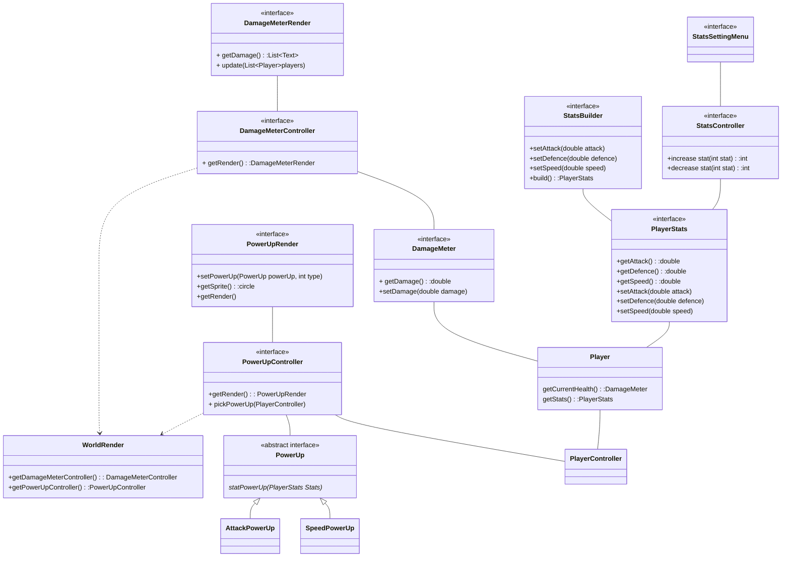
```mermaid
classDiagram


DamageMeterController -- DamageMeter

DamageMeterRender -- DamageMeterController

DamageMeterController ..> WorldRender

DamageMeter -- Player


class DamageMeterRender{

<<interface>>

+ getDamage():List~Text~

+ update(List~Player~players)

}


class DamageMeterController{

<<interface>>

+ getRender():DamageMeterRender


}

class DamageMeter{

<<interface>>

+ getDamage():double

+setDamage(double damage)


}

class WorldRender{
    +getDamageMeterController(): DamageMeterController
    +getPowerUpController():PowerUpController
}

class Player{
    getCurrentHealth():DamageMeter
}


PowerUp <|-- AttackPowerUp

PowerUp <|-- SpeedPowerUp

PowerUpController -- PowerUp

PowerUpRender -- PowerUpController

PowerUpController ..> WorldRender


class Player{
    getStats():PlayerStats
}

class PowerUp{

<<abstract interface>>

statPowerUp(PlayerStats Stats)*

}


class PowerUpController{

<<interface>>

+getRender(): PowerUpRender

+ pickPowerUp(PlayerController)

}

class PowerUpRender{

<<interface>>

+setPowerUp(PowerUp powerUp, int type)

+getSprite():circle

+getRender()

}


StatsBuilder -- PlayerStats

StatsController -- PlayerStats

StatsSettingMenu -- StatsController

PlayerStats -- Player

PowerUpController -- PlayerController

Player -- PlayerController


class StatsBuilder{

<<interface>>

+setAttack(double attack)

+setDefence(double defence)

+setSpeed(double speed)

+build():PlayerStats

}

class PlayerStats{

<<interface>>


+getAttack():double

+getDefence():double

+getSpeed():double


+setAttack(double attack)

+setDefence(double defence)

+setSpeed(double speed)


}

class StatsController{

<<interface>>


+increase stat(int stat):int

+decrease stat(int stat):int


}


class StatsSettingMenu{

<<interface>>


}
```

### Design dettagliato

#### Alessia Carfì:

Nel progetto mi sono occupata della realizzazione di:

- gestione del personaggio e del movimento 2D
- gestione della hitbox (quindi il limite in cui il personaggio può essere colpito dall'avversario)
- comandi di gioco

In seguito parlerò nel dettaglio di tutti i problemi da me riscontrati e di come ho deciso di risolverli.

##### Gestione del movimento 2D

Ho cominciato gestendo il movimento 2D. La soluzione è stata creare una classe **Player** nel model, nella quale sono stati scritti i metodi necessari per modificare la direzione del personaggio, insieme all'implementazione di un metodo _update_ che aggiornava la posizione del personaggio nel _game loop_.

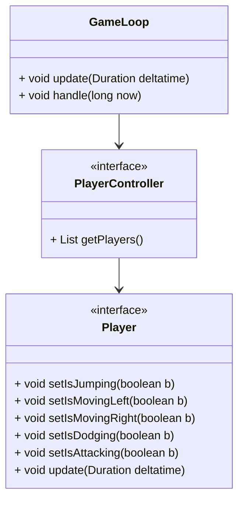
```mermaid
classDiagram

PlayerController --> Player

GameLoop --> PlayerController


class Player{

<<interface>>

+ void setIsJumping(boolean b)


+ void setIsMovingLeft(boolean b)


+ void setIsMovingRight(boolean b)


+ void setIsDodging(boolean b)


+ void setIsAttacking(boolean b)


+ void update(Duration deltatime)


}


class PlayerController {

<<interface>>

+ List<Player> getPlayers()

}


class GameLoop {

+ void update(Duration deltatime)

+ void handle(long now)

}
```

##### Gestione delle hitbox

Il personaggio aveva la necessità di avere una hitbox che gli permettesse di individuare le collisioni con l'altro personaggio, gli oggetti, i powerup e la piattaforma di gioco.
Come soluzione ho deciso di creare una classe che utilizzasse due cerchi:

- uno grande che gli avrebbe permesso di individuare le collisioni con le altre entità di gioco;
- uno più piccolo per i piedi per individuare la collisione col pavimento. - In particolare ho scelto di avere due cerchi differenti per evitare possibili problemi. Infatti nel nostro gioco è possibile saltare fuori dalla piattaforma e, in caso di collisione con essa all'esterno, il player avrebbe potuto fluttuare pur non avendo i piedi per terra.
  Istanzio poi questa _hitbox_, nella classe _Player_ in modo da poter essere aggiornata insieme alla posizione del personaggio.

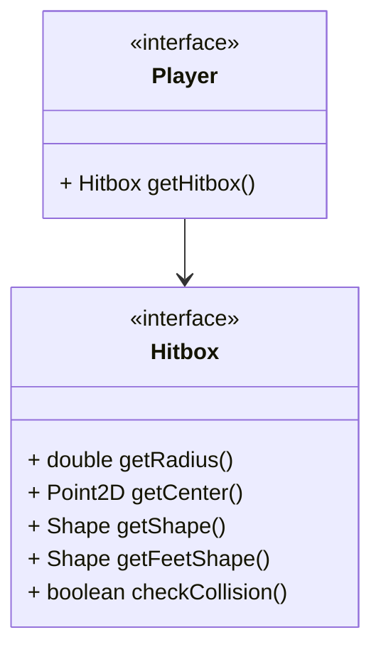
```mermaid
classDiagram

Player --> Hitbox


class Hitbox{

<<interface>>


+ double getRadius()


+ Point2D getCenter()


+ Shape getShape()


+ Shape getFeetShape()


+ boolean checkCollision()


}


class Player{

<<interface>>


+ Hitbox getHitbox()

}
```

##### Gestire l'aggiornamento dello sprite del personaggio

Per fare si che lo _sprite_ si aggiornasse, ho fatto in modo che il model del player potesse comunicare con la sua view tramite un controller. Questo infatti, permetteva alla view di fare avere la posizione e lo stato corrente del player in modo che potesse essere aggiornata e seguire il player.

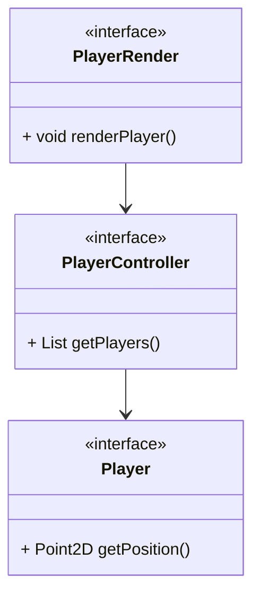
```mermaid
classDiagram

PlayerController --> Player

PlayerRender --> PlayerController


class PlayerRender{

<<interface>>


+ void renderPlayer()

}


class PlayerController{

<<interface>>


+ List<Player> getPlayers()

}


class Player{

<<interface>>


+ Point2D getPosition()

}
```

##### Gestione dei comandi di gioco

Per la gestione dei comandi, ho pensato che il modo migliore per tenere separato il model dalla view fosse l'utilizzo dell'**Observer Pattern**:

- **Observer** -> _player_
- **Observable** -> classe che "osserva" il player.

Ho creato entrambe le interfacce nella view del progetto, poiché si occupano di prendere gli input da tastiera. Ho poi esteso l'_observer_ nel controller e gestito tutti gli eventi per ogni giocatore.
Ho scritto i comandi possibili in un file YAML per la configurazione dei tasti, evitando ripetizioni e semplificando la gestione dei comandi.

La classe che estende l'_Observable_, invece, è tenuta all'interno della view e si occupa di notificare gli _observer_ quando è stato effettivamente premuto un tasto.

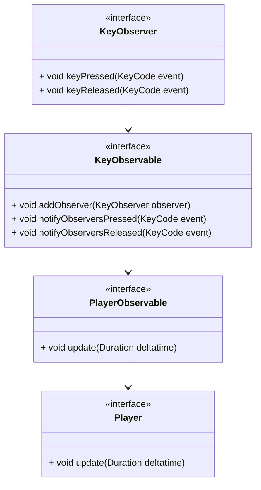
```mermaid
classDiagram

KeyObserver --> KeyObservable

KeyObservable --> PlayerObservable

PlayerObservable --> Player


class PlayerObservable{

<<interface>>


+ void update (Duration deltatime)

}


class KeyObservable{

<<interface>>


+ void addObserver(KeyObserver observer)

+ void notifyObserversPressed(KeyCode event)

+ void notifyObserversReleased(KeyCode event)

}


class KeyObserver{

<<interface>>


+ void keyPressed(KeyCode event)

+ void keyReleased(KeyCode event)

}


class Player{

<<interface>>


+ void update(Duration deltatime)

}
```

##### Comandi fluidi e reattivi

Ho provato a implementare i comandi di gioco diverse volte, ma alla fine, il metodo migliore si è rivelato l'utilizzo di _boolean_ per ogni "stato" del player nel suo model. Questi, vengono aggiornati dall'observer in base ai controlli effettuati. Questi _boolean_ poi vengono utilizzati nell'update del player per modificare la posizione del personaggio, in questo modo possono esserci più "stati" contemporaneamente e il movimento risulta essere più fluido.

#### Giacomo Grassetti

Nella realizzazione del progetto, il mio ruolo all'interno del gruppo era quello di creare e gestire le seguenti funzionalità. Si evince che con la parola _entità_ si intendono le varie tipologie di oggetti all'interno dell'area di gioco (ad esempio armi, powerUp, terreno, personaggi):

- **Fisica delle entità**: si intente come il personaggio si muove e interagisce con le diverse entità;
- **Creazione dell'area di gioco**: creazione della mappa di gioco e l'aggiunta delle diverse entità;
- **Gestione degli attacchi**: come capire quanto un personaggio attacca l'altro e l'eventuale danno arrecato;
- **Gestione caduta delle armi**: si intende come e quando le armi compaiono e cadono nell'area di gioco, e come un personaggio possa raccoglierle.

##### Creazione delle entità (Model)

Prima di parlare e descrivere le funzionalità, capiamo come sono state effettivamente create le entità all'interno del gioco. Suddivideremo le entità in: **Armi**, **Blocchi**, **Personaggio**.

##### Armi:

Ogni arma all'interno di PowPaw avrà diverse caratteristiche, quali _grandezza_, _posizione_ e _forza di attacco_, a seconda della tipologia che si andrà a creare. Ho quindi deciso di creare una classe **_WeaponFactory_**, ossia una Factory di Weapon. Il compito di questa classe è quindi quella di creare diverse tipologie di armi tramite il metodo **_createWeapon()_**, il quale, con l'utilizzo di un numero identificativo **id**, creerà randomicamente una spada oppure un martello da guerra. Ogni arma sarà quindi un oggetto di tipo **_WeaponImpl_**, ossia una classe la quale conterrà tutte le caratteristice dell'arma descritte il precedenza. Molto importante notare che anche la posizione, quindi la X e la Y, dell'arma è data in modo randomico, così da poter spownarle in diversi punti all'interno della mappa di gioco. Inoltre, ogni arma ha una cosiddetta **_durability_**, ossia una numero intero che determina quante volte può essere utilizzati prima che si rompa e scompaia. Per la realizzazione della classe **_WeaponImpl_** si è ricorsi alla creazione della sua relativa interfaccia **Weapon**, la quale racchiude in maniera ordinata tutti i suoi metodi pubblici usate della altri classi del progetto.

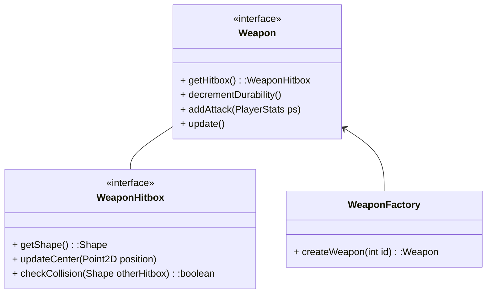
```mermaid
classDiagram
	Weapon -- WeaponHitbox
	Weapon <-- WeaponFactory

	class Weapon{
	<<interface>>
	+ getHitbox():WeaponHitbox
	+ decrementDurability()
	+ addAttack(PlayerStats ps)
	+ update()
	}

	class WeaponHitbox{
	<<interface>>
	+ getShape():Shape
	+ updateCenter(Point2D position)
	+ checkCollision(Shape otherHitbox):boolean
	}

	class WeaponFactory{
	+ createWeapon(int id):Weapon
	}
```

##### Blocchi

Per la creazione dei blocchi, ossia quelle entità che costruiranno il terreno di gioco, la scelta adottata è stata simile a quelle delle armi. Si è creata quindi una classe **_BlockFactory_**, ossia una factory di blocchi che si occuperà, tramite il metodo **_createBlock()_** di creare un blocco di tipo **_BlockImpl_**. La scelta di creare una factory per la creazione dei blocchi è stata presa in seguito al seguente ragionamento:
nell'area di gioco potrebbero esserci blocchi con diverse caratteristiche, ad esempio blocchi che arrecano un certo danno quando un player ci passa sopra, blocchi che scompaiono con la collisione di una entità ecc... . Per questo progetto, per ragioni di tempo, la tipologia di blocchi è solo una. Ho comunque deciso di tenere questa factory per facilitare la creazione di altri blocchi in un futuro o qual'ora si voglia estendere questo software.
Nella classe **BlockImpl** ci sarà quindi una posizione, una grandezza e una altezza relativa al blocco.

##### Creazione della mappa di gioco

Per la creazione della mappa di gioco è stata implementata una classe **_CreateMap_** ove nella quale, tramite il metodo **_createTerrains()_**, verrà popolato un ArrayList di BlockImpl (ognuno creato tramite **BlockFactory**), che definirà il terreno giocabile nell'area di gioco.

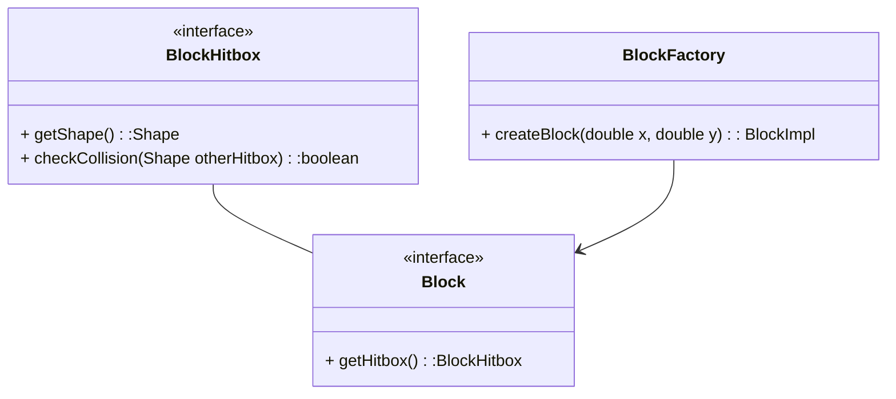
```mermaid
classDiagram
	BlockHitbox -- Block
	BlockFactory --> Block

	class BlockHitbox{
	<<interface>>
	+ getShape():Shape
	+ checkCollision(Shape otherHitbox):boolean
	}

	class Block{
	<<interface>>
	+ getHitbox():BlockHitbox
	}

	class BlockFactory{
	+ createBlock(double x, double y): BlockImpl
	}
```

##### Fisica delle entità

Per la realizzazione della fisica delle diverse entità nel gioco, si è ricorso alla creazione di diverse hitbox e hurtbox con una posizione e una grandezza ben specifica, che servirà a creare il "corpo" dell'entità.

##### Hitbox Armi

Nella classe **WeaponImpl** descritta in precedenza, è stata creata anche una istanza di tipo **_WeaponHitboxImpl_**, ossia la classe che gestisce la hitbox dell'arma. Per la creazione della forma dell'hitbox è stata scelto il rettangolo, considerando quindi che un'arma ha forma pressoché rettangolare. Per la gestione del movimento della hitbox con il personaggio, è stato implementato il metodo **_updateCenter()_** che avrà quindi il compito di spostare la hitbox a seconda della posizione dell'arma specificata nella classe **_WeaponImpl_**. Anche qui, la classe possiede una sua interfaccia **_WeaponHitbox_** che conterrà i metodi pubblici usate della altri classi del progetto.

##### Hitbox Blocchi

Come per le armi, nella classe **_BlockImpl_** è presente una istanza di tipo **_BlockHitboxImpl_**, ossia la classe che gestisce la hitbox del blocco. Questa hitbox è particolarmente significativa in quanto sarà fondamentale per capire se una entità tocca il terreno oppure no. Questo punto sarà specificato e descritto più avanti nella sezione della _gestione delle collisioni_. Anche qui come per le ami, la classe possiede una sua interfaccia **_BlockHitbox_** che conterrà i metodi pubblici usate della altri classi del progetto.

##### Hitbox braccio del player

Uno dei principali problemi riscontrati era come gestire la collisione del player con l'avversario per arrecargli danno. Utilizzare la hitbox del player non mi sembrava una scelta adeguata in quanto per fa si che l'attacco vada a segno, i due player dovrebbero toccarsi coi propri "corpi". Ho quindi deciso di creare una Hitbox dedicata al "braccio" del player. Quindi è stata creato un rettangolo all'interno della classe **_PlayerHitboxImpl_** creata da Alessia, che rappresenta la forma del braccio del player. Questo rettangolo, che da ora chiameremo **armHitbox** avrà un posizione sempre fissata al player, una altezza e una grandezza variabile.

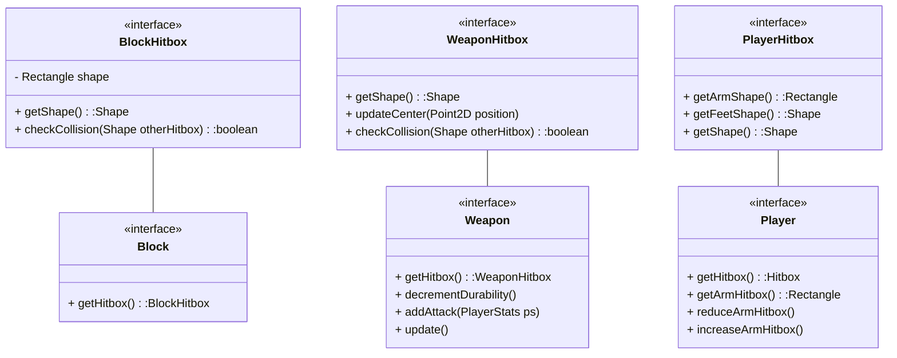
```mermaid
classDiagram
	BlockHitbox -- Block
	WeaponHitbox -- Weapon
	PlayerHitbox -- Player
	class WeaponHitbox{
	<<interface>>
	+ getShape():Shape
	+ updateCenter(Point2D position)
	+ checkCollision(Shape otherHitbox):boolean
	}

	class Weapon{
	<<interface>>
	+ getHitbox():WeaponHitbox
	+ decrementDurability()
	+ addAttack(PlayerStats ps)
	+ update()
	}

	class BlockHitbox{
	<<interface>>
	- Rectangle shape
	+ getShape():Shape
	+ checkCollision(Shape otherHitbox):boolean
	}

	class Block{
	<<interface>>
	+ getHitbox():BlockHitbox
	}

	class Player{
	<<interface>>
	+ getHitbox():Hitbox
	+ getArmHitbox():Rectangle
	+ reduceArmHitbox()
	+ increaseArmHitbox()
	}

	class PlayerHitbox{
	<<interface>>
	+ getArmShape():Rectangle
	+ getFeetShape():Shape
	+ getShape():Shape
	}
```

###### Gestione delle collisioni

La scelta adottata in precedenza, quindi quella della creazione di diverse hitbox per le varie entità, è stata molto utile per la gestione delle collisioni all'interno del gioco. Ogni hitbox creata possiede, come già enunciato, una **Shape**, ossia un oggetto di forma geometrica (Circolare per il player, rettangolare per le armi, ...) il quale contiene il metodo **getBoundsInParent()**. Questo getter ha il compito di ritornare le estremità della forma geometrica tramite un oggetto di tipo **Bounds**.
Per gestire quindi le collisioni, ho deciso di creare una classe statica chiamata **_TransitionImpl_**, la quale contiene diversi metodi per gestire le collisioni tra diverse entità. Elenchiamo e discutiamo i metodi principali:

- `private boolean checkCollisionByPos(Point2D pos)`: questo metedo gestisce la collisione con il terreno di una entità tramite la sua posizione di tipo **Point2D**, ossia un vettore con una X e una Y, restituendo `true` se la posizione interseca quella del terreno. La classe **TransitionImpl** avrà infatti come campo privato un **ArrayList** di **BlockImpl** che identificheranno il terreno giocabile nella mappa, come enunciato in precedenza.
- `public boolean checkPlayerInTerrain(Shape feetBox)`: questo metodo gestisce la collisione con il terreno con il player tramite l'utilizzo della sua **feetbox**, ossia l'hitbox circolare dedicata ai piedi del player, descritta da Alessia. Restituisce `true` se l'hitbox interseca quella del terreno.

Per quanto riguarda la gestione della collisione per le armi, nella classe **_PlayerImpl_** creata da Alessia ci sarà un metodo `boolean checkCollision(Shape shape)` che controllerà se l'hitbox globale del player interseca quella di un'arma.

##### Controllo delle entità (Controller)

Ogni entità ha un suo relativo controller. Questi controller sono fondamentali per aggiornare e settare le proprietà dell'entità che descrivono. Andremo ad approfondire i controller relativi alle armi e agli attacchi:

- `WeaponControllerImpl`: classe controller che si occupa di aggiornare lo spwan delle armi nell'area di gioco. All'interno di questo controller ci sarà quindi l'istanza di una **_WeaponImpl_** che si andrà a controllare. Lo spwan delle armi avviene come segue. All'inizio di ogni game, verrà creata un'arma che cadrà a terra nell'area di gioco. Quando un player toccherà l'arma, quindi piu' specificamente la sua hitbox, essa verrà settata come proprietà opzionale del player in considerazione. Quando l'arma avrà esaurito la sua **durability** (che desciveremo nella parte degli attacchi in seguito), essa si distruggerà e ne verrà spwnata un nuova. Quando un player acquisisce un'arma, l'hitbox del suo braccio, ossia l'**armHitbox**, aumenterà di grandezza, rendendo quindi piu' semplice colpire l'avversario da una distanza maggiore.

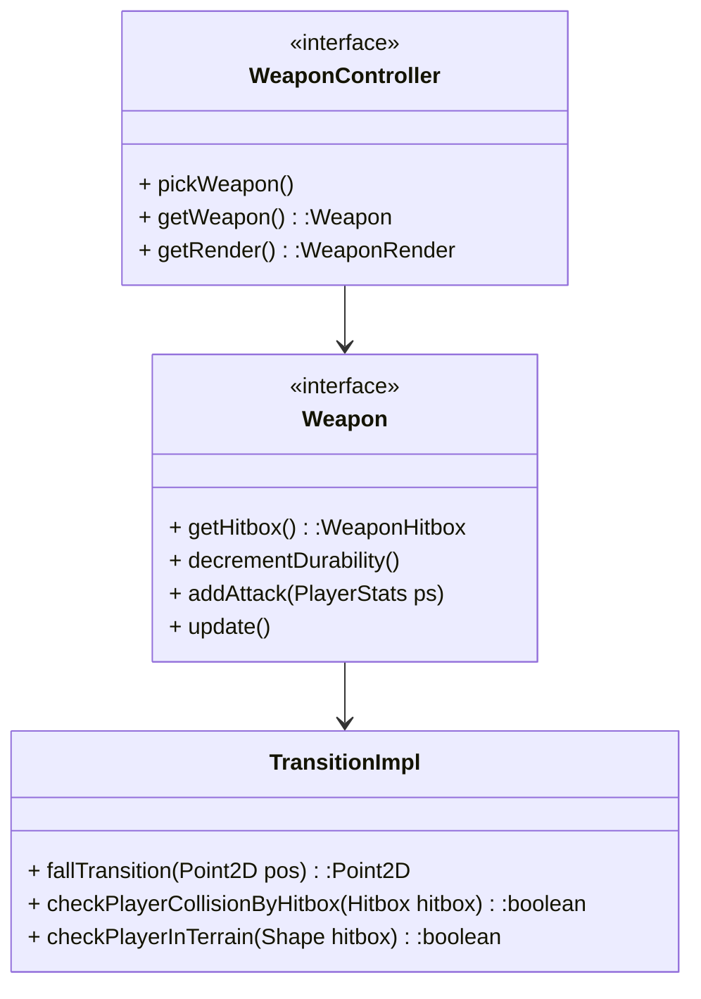
```mermaid
classDiagram

WeaponController --> Weapon

Weapon --> TransitionImpl

class Weapon{

<<interface>>

+ getHitbox():WeaponHitbox

+ decrementDurability()

+ addAttack(PlayerStats ps)

+ update()

}

class WeaponController{

<<interface>>

+ pickWeapon()

+ getWeapon():Weapon

+ getRender():WeaponRender

}

class TransitionImpl{

+ fallTransition(Point2D pos):Point2D

+ checkPlayerCollisionByHitbox(Hitbox hitbox):boolean

+ checkPlayerInTerrain(Shape hitbox):boolean

}
```

- `AttackControllerImpl`: classe controller che gestisce gli attacchi. Ci sono due metodi fondamentali al suo interno. Il metodo **_void checkHit(Player player)_** controllerà se l'**_armHitbox_** di un player interseca l'hitbox globale del player passato come parametro. Se ciò avviene, al player colpito verrà arrecato un danno pari alla potenza di attacco del player che ha sferrato il colpo tramite il metodo **_receiveAttack_** all'interno di **PlayerImpl**.
  Se il colpo andrà a segno, verrà richiamato il metodo **_decreaseDurability()_** dell'arma, diminuento la sua durevolezza di una unità fino ad un massimo di 10.
  Il secondo metodo fondamentale di questo controller è il **_Optional\<Player\> checkDeath()_**, che ritornerà un **Optional di Player** se uno dei due giocatori esce dal confine di gioco, altrimenti un **Optional vuoto**.

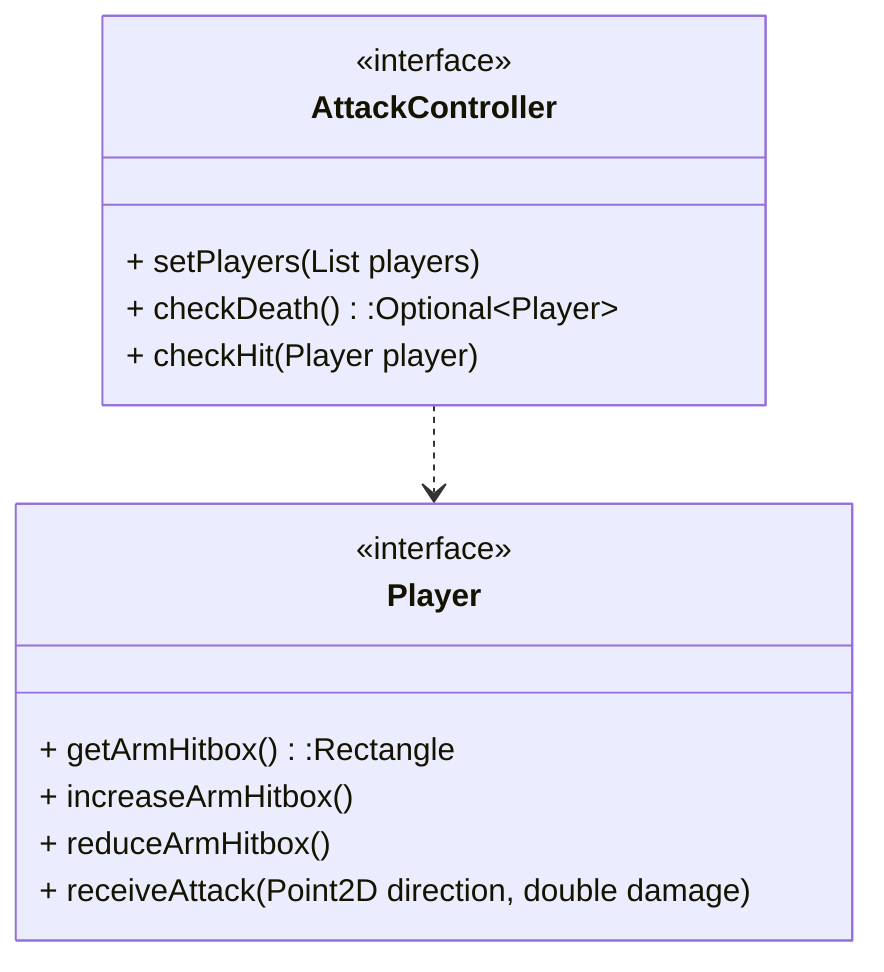
```mermaid
classDiagram

AttackController ..> Player

class Player{

<<interface>>

+ getArmHitbox():Rectangle

+ increaseArmHitbox()

+ reduceArmHitbox()

+ receiveAttack(Point2D direction, double damage)

}

class AttackController{

<<interface>>

+ setPlayers(List<Player> players)

+ checkDeath():Optional~Player~

+ checkHit(Player player)

}
```

Come ultimo controller, è bene specificare il **_MapController_**, una classe dedicata al set delle proprorzioni del terreno dell'area di gioco in base alla grandella dello schermo. Per ragioni di tempo, abbiamo impostato una grandezza prefissata di 1280 x 720. Tale classe è stata concepita appunto qual'ora si voglia aggiungere una selezione della grandezza della finestra.

###### Gestione della morte

Per la gestione della morte, quindi il gamer over di un player, si fa rifermento al metodo **_checkDeath()_** appena descritto. Questo medoto è richiamato all'interno dell'**update()** del **_PlayerObervableImpl_** descritto da Alessia, per far si che tale controllo sia eseguito ad ogni frame.

##### Render delle entità (View)

Per far si che le varie entità vengono effettivamente mostrate a video, bisogna renderizzarle. Ogni tipo di entità avrà quindi una classe dedicata con il compito di graficarle. Prendiamo come esempio la classe **_WeaponRender_**. Tale classe ha il compito di assegnare uno sprite, quindi una immagine, dell'entità che essa rappresenta (in questo caso l'arma). Siccome le armi possono avere diverse caratteristiche (si ricordi la **_WeaponFactory_** descritta), dovranno avere anche uno sprite diverso a seconda di che tipologia di arma dobbiamo graficare. In questa classe, tramite il metodo **_setSpriteImage()_**, si assegnerà una immagine a seconda della tipologia di arma che il controller ha creato. Ogni classe relativa al render di una entità avrà un metodo **_render()_** fondamentale per il corretto movimento e tracciamento della hitbox dell'entità. Essa infatti aggiornerà automaticamente la posizione dell'immagine con quella dell'hitbox del modello da graficare.
Le classi **_MapRender_** e **_PlayerRender_** faranno la stessa cosa.
Un'ulteriore spiegazione fondamenale da descrivere è quando un player prende un'arma. Lo sprite dell'arma raccolta sarà resa visibile nella mano del giocatore che la possiede. Per fare cio, lo sprite dell'arma dovrà semplicemente seguire la posizione dell'**armHitbox** del player tramite il metodo **_render()_** descritto.

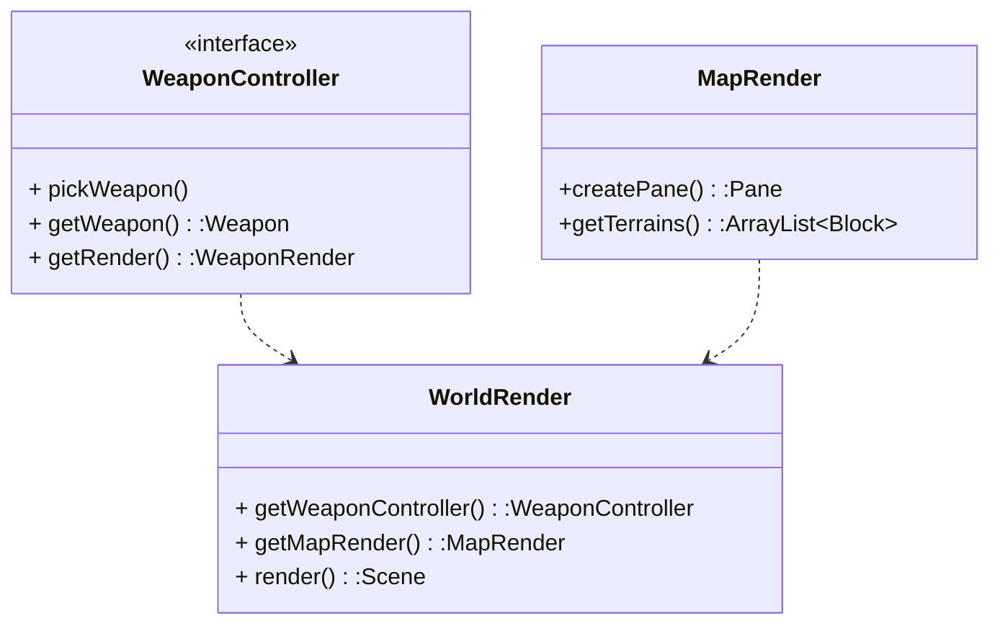
```mermaid
classDiagram

WeaponController ..>WorldRender

MapRender ..>WorldRender


class MapRender{

+createPane():Pane

+getTerrains():ArrayList~Block~

}

class WeaponController{

<<interface>>

+ pickWeapon()

+ getWeapon():Weapon

+ getRender():WeaponRender

}

class WorldRender{

+ getWeaponController():WeaponController

+ getMapRender():MapRender

+ render():Scene

}
```

#### Simone Collorà:

##### Gestione PowerUp

Per i powerUp inizialmente pensavo di usare un'unica classe ma alla fine ho optato per una classe per ogni powerUp che implementassero la classe astratta powerUp. Sia in AttackPowerUp che in SpeedPowerUp ho usato timeline per far aumentare la statistica di 7 secondi. Nel PowerUpController viene creato il render e deciso di quale tipo sarà il powerUp. Il metodo pickPowerUp controlla se l'hitbox di un player ha toccato il powerUp e se il boolean isCollected è false allora il powerUp verrà dato al player che l'ha toccato, isCollected diventerà true e il powerUp verrà reso invisibile per 10 secondi finchè isCollected verrà reso di nuovo false e verrà creato un nuovo powerUp che sarà reso visibile. Chose powerUp crea il powerUp randomicamente e il numero random verrà passato al render per decidere il colore di questo(blu per l'attacco e rosso per la velocità)

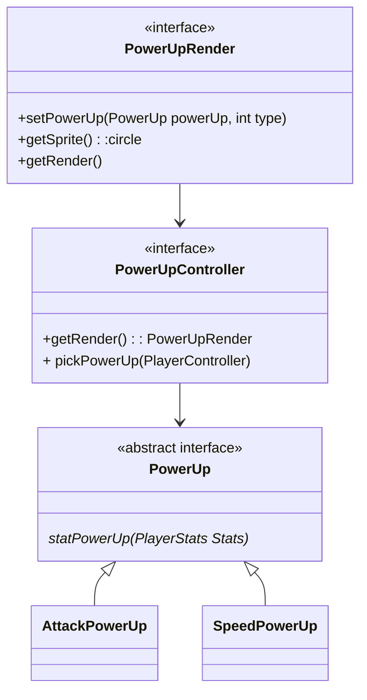
```mermaid
classDiagram


PowerUp <|-- AttackPowerUp


PowerUp <|-- SpeedPowerUp


PowerUpController --> PowerUp

PowerUpRender --> PowerUpController


class PowerUp{


<<abstract interface>>


statPowerUp(PlayerStats Stats)*


}


class PowerUpController{


<<interface>>


+getRender(): PowerUpRender


+ pickPowerUp(PlayerController)


}


class PowerUpRender{


<<interface>>


+setPowerUp(PowerUp powerUp, int type)

+getSprite():circle

+getRender()

}
```

##### Gestione stati di gioco

Per gli stati di gioco(START,STATS,GAME,GAMEOVER) ho deciso di usare un controller che a seconda dell'esigenza setta lo stato di gioco e una classe GameStateView che cambia lo stage a seconda della necessità. Lo state è creato in maniera statica in una classe separata. I cambi di stato sono attivati nella classe StartMenu premendo "START" (da START a STATS), nella classe StatsSettingMenu premendo "FINISH"(da START a GAME) e premendo MENU(da STATS a START). Il game over viene attivato nel PlayerObservable una volta che uno dei giocatori risulta morto mentre nel GameOver è presente restart che riporta al menu stats.

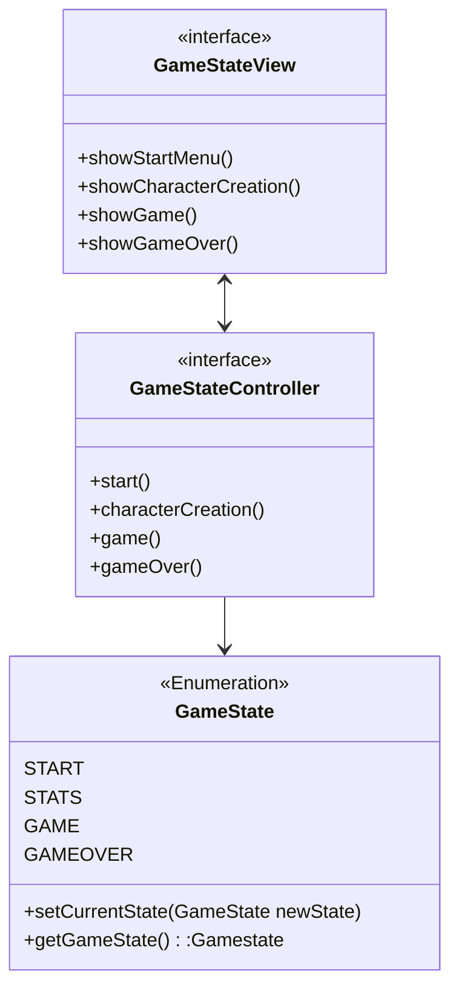
```mermaid
classDiagram


GameStateController --> GameState

GameStateView <--> GameStateController


class GameState{


<<Enumeration>>


START

STATS

GAME

GAMEOVER


+setCurrentState(GameState newState)

+getGameState():Gamestate


}


class GameStateController{


<<interface>>


+start()


+characterCreation()


+game()


+gameOver()


}


class GameStateView{


<<interface>>


+showStartMenu()

+showCharacterCreation()

+showGame()

+showGameOver()


}
```

##### Gestione statistiche:

Per le statistiche ho creato una classe PlayerStats con le statistiche di attacco, difesa e velocità. Il suo costruttore prende Tutte e tre le statistiche come paramentri e sarà costruito tramite una classe StatsBuilder. La classe StatsController aumenta e diminuisce una statistica da un minimo di 5 ad un massimo di 10. Questi saranno usati nello StatsView in cui gli utenti possono aumentare o diminuire le statistiche a piacimento con 7 punti ciascuno da dividere nelle proprie statistiche. Appena l'utente clicca finish queste saranno buildate tramite il builder e passate allo StaticPlayerStats e quindi ai players.

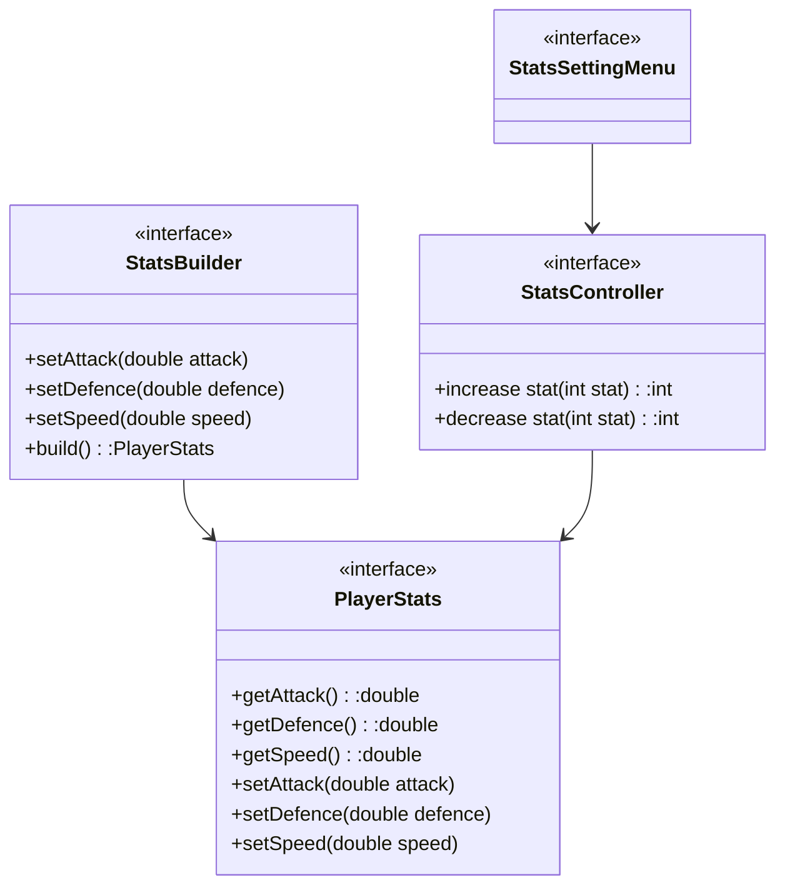
```mermaid
classDiagram
StatsBuilder --> PlayerStats
StatsController --> PlayerStats
StatsSettingMenu --> StatsController
class StatsBuilder{

<<interface>>
+setAttack(double attack)
+setDefence(double defence)
+setSpeed(double speed)
+build():PlayerStats
}

class PlayerStats{
<<interface>>
+getAttack():double
+getDefence():double
+getSpeed():double
+setAttack(double attack)
+setDefence(double defence)
+setSpeed(double speed)
}

class StatsController{
<<interface>>
+increase stat(int stat):int
+decrease stat(int stat):int
}

class StatsSettingMenu{
<<interface>>
}
```

##### Gestione Dannometro:

Per il dannometro ho creato una classe DamageMeter che ha un double damage settato a 0, un getter e un setter. Il setter aumenta il valore invece di settarlo poiché il danno sale sempre e non scende. Il meter viene renderizzato tramite DamageMeterRender che trasforma il double in un Text. Avendo ogni player un damage ma dovendo cambiare la posizione ho preferito fare una lista di Text. Questi saranno poi moltiplicati x10 per rendere l'interfaccia più user friendly. Un nuovo render sarà creato nel controller

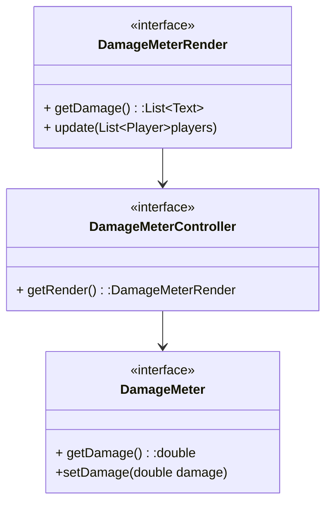
```mermaid
classDiagram


DamageMeterController --> DamageMeter


DamageMeterRender --> DamageMeterController


class DamageMeterRender{


<<interface>>


+ getDamage():List~Text~

+ update(List~Player~players)


}


class DamageMeterController{


<<interface>>


+ getRender():DamageMeterRender


}


class DamageMeter{


<<interface>>


+ getDamage():double

+setDamage(double damage)


}
```

## Sviluppo

### Testing automatizzato

Nel corso della realizzazione del progetto PowPaw, è stato necessario crare dei test automatizzati che prevedessero la corretta creazione e posizionamento delle entità dell'are di gioco. Abbiamo quindi creato dei semplici test per verificare il corretto funzionamento di tali entità, controller e view. I test sono stati realizzati grazie alla libreria **JUnit**. Nello specifico:

- **_PlayerTest_** -> controlla se:
  - alla creazione del player, gli si assegni il numero del player
  - se si assegna la posizione iniziale
  - se si assegna la grandezza del player
  - se cambia posizione
  - se cambia stato
- **_GameMap_** : si occupa di testare se il terreno è nella giusta posizione e contiene tutti i blocchi necessari a crearlo. I test prendono il nome di:
  - `void checkTerrainTest()`;
  - `void checkBlockPositionTest()`.
- **_WeaponTest_** : si occupa di testare se un'arma viene creata correttamente a seconda della sua tipologia, se viene effetivamente raccolta da un player e se ad ogni attaco si danneggia. I metodi di test prendono il nome di:
  - `void weaponFactoryTest()`;
  - `void weaponOptionalTest()`;
  - `void weaponDurabilityTest()`.
- **_StatsTest_** : si occupa di testare se il builder del PlayerStats e il dannometro funzionano correttamente. I test sono:
  - `void getStats()`
  - `void getDamage()`

### Metodologia di lavoro

Abbiamo scelto di adottare **DVCS Git** per la realizzazione di questo progetto, come ci è stato suggerito. Inizialmente, abbiamo creato un _branch_ individuale per ogni membro del team, in modo da permettere un lavoro individuale e una successiva unificazione su un unico _branch_ principale ("**main**").

Durante lo svolgimento del progetto, ci siamo resi conto dell'importanza di creare ulteriori branch di supporto. Ad esempio, abbiamo creato branch specifici per il player e la sua hitbox e gli altri oggetti di gioco, così abbiamo potuto verificare la corretta collisione tra oggetti e il loro corretto raccoglimento senza interferire con il lavoro degli altri membri del team o con il branch main. Questa scelta ci ha permesso di testare, correggere e migliorare tutti gli aspetti del progetto in modo accurato ed efficiente.

##### Alessia Carfì

- **Model**:
  - Creazione dell'entità **Player** (solo la parte riguardante il suo movimento 2D)
  - Creazione dell'**Hitbox** del player
- **View**:
  - Creazione del **Render** del player
  - Creazione della classe **WordRender** per la gestione più ottimale di tutto il mondo di gioco
  - Creazione dell'interfaccia **KeyObserver** e dell'interfaccia e della classe del **KeyObservable** per ricevere i comandi da tastiera
- **Controller**:
  - Creazione del **Controller** del player
  - Creazione del **Game Loop**
  - Implementazione del **KeyObserver** per la gestione dei comandi di gioco
  - Implementazione del **PlayerObservable** per aggiornare lo stato del player e gestire gli input attraverso il **KeyObservable**
- **Testing**:
  - Creazione dei test per il player
- **Config**:
  - Uso del **Parser** per il file di configurazione _YAML_

##### Giacomo Grassetti

- **Model**:
  - creazione dell'entità **Block** e relativa factory;
  - creazione dell'entità **BlockHitbox**;
  - creazione dell'entità **Weapon** e relativa factory;
  - creazione dell'entità **WeaponHitbox**;
  - creazione dell'hitbox relativa al braccio nella classe **Player**;
  - creazione della classe **Transition** per la gestione delle collisioni;
- **Controller**
  - creazione del controller **MapController**;
  - creazione del controller **WeaponController**;
  - creazione del controller **AttackController**;
- **View**
  - creazione della classe view **MapRender**;
  - creazione della classe view **WeaponRender**;
  - implementazione del render dello sprite relitiva all'**armHitbox** del **Player**.
- **Testing**
  - creazione di test per la corretta generazione della mappa;
  - creazione di test per la corretta creazione, posizionamento e pickUp dell'arma;

##### Simone Collorà

- **Model**:
  - Creazione **DamageMeter**
  - Creazione dell'entità **PowerUp** e dei suoi derivati **AttackPowerUp** e **SpeedPowerUp**
  - Creazione **PlayerStats** e **StatsBuilder** per le statistiche dei players
- **View**:
  - Creazione di **StartMenu**, **StatsSettingMenu** e **GameOver**
  - Creazione di **GameStateView** per mostrare a video un determinato stato
  - Creazione **PowerUpRender** per renderizzare il PowerUp e il tipo
- **Controller**:
  - Creazione **GameStateController** per far cambiare lo stato di gioco
  - Creazione **StatsController** per aumentare o diminuire una determinata statistica
  - Creazione **DamageMeterController** per il settaggio del render
  - Creazione **PowerUpController** per la gestione del comportamento del power up e la decisione di quale sarà creato
- **Testing**:
  - Test per il corretto funzionamento del dannometro
  - Test per il corretto funzionamento del builder

### Note di sviluppo

##### Alessia Carfì

- Utilizzo di **Stream** e **lambda expression**:
  - Usate ovunque, esempi:
    - `https://github.com/alessia-carfi/OOP22-powpaw/blob/072dd4ad797134026df1618774f66dbaf52424f0/app/src/main/java/powpaw/Word/view/impl/WorldRenderImpl.java#L69`
    - `https://github.com/alessia-carfi/OOP22-powpaw/blob/072dd4ad797134026df1618774f66dbaf52424f0/app/src/main/java/powpaw/config/Parser.java#L40`
- Utilizzo della libreria **org.yaml.snakeyaml.Yaml**:
  - `https://github.com/alessia-carfi/OOP22-powpaw/blob/072dd4ad797134026df1618774f66dbaf52424f0/app/src/main/java/powpaw/config/Parser.java#L17`
- Uso di JavaFX:
  - Usato ovunque, esempio:
    - `https://github.com/alessia-carfi/OOP22-powpaw/blob/072dd4ad797134026df1618774f66dbaf52424f0/app/src/main/java/powpaw/core/GameLoop.java#L16`
- Crediti:
  - metodo per ruotare gli sprite: `https://gist.github.com/jewelsea/1436941`

##### Giacomo Grassetti

- Utilizzo di **Stream** e **lambda expression**:
  - Usate ovunque, esempi:
    - `https://github.com/alessia-carfi/OOP22-powpaw/blob/072dd4ad797134026df1618774f66dbaf52424f0/app/src/main/java/powpaw/Word/view/impl/WorldRenderImpl.java#L72 `
    - `https://github.com/alessia-carfi/OOP22-powpaw/blob/072dd4ad797134026df1618774f66dbaf52424f0/app/src/main/java/powpaw/Weapon/view/impl/WeaponRenderImpl.java#L66`
- Utilizzo pattern **Factory**;
  - `https://github.com/alessia-carfi/OOP22-powpaw/blob/072dd4ad797134026df1618774f66dbaf52424f0/app/src/main/java/powpaw/Weapon/model/impl/WeaponFactory.java`
- Uso di **JavaFx**:
  - Usato ovunque, esempio:
    - `https://github.com/alessia-carfi/OOP22-powpaw/blob/072dd4ad797134026df1618774f66dbaf52424f0/app/src/main/java/powpaw/Weapon/view/impl/WeaponRenderImpl.java#L53`
    - `https://github.com/alessia-carfi/OOP22-powpaw/blob/072dd4ad797134026df1618774f66dbaf52424f0/app/src/main/java/powpaw/core/GameLoop.java#L16`

##### Simone Collorà

Utilizzo di **Stream** e **lambda expression**: - Usate ovunque, esempi: - `https://github.com/alessia-carfi/OOP22-powpaw/blob/2778c0f797fe2f956f42e5304c1b95eb90fc4c47/app/src/main/java/powpaw/powerup/controller/impl/PowerUpControllerImpl.java#L41` - `https://github.com/alessia-carfi/OOP22-powpaw/blob/2778c0f797fe2f956f42e5304c1b95eb90fc4c47/app/src/main/java/powpaw/powerup/model/impl/AttackPowerUp.java#L21`

- Utilizzo pattern **Builder**;
  - `https://github.com/alessia-carfi/OOP22-powpaw/blob/6221acb60ee5d0b0a91ce57108cc523a8080b8db/app/src/main/java/powpaw/player/model/impl/StatsBuilderImpl.java#L14`
- Uso di **JavaFx**: - Usato ovunque, esempio: - `https://github.com/alessia-carfi/OOP22-powpaw/blob/2778c0f797fe2f956f42e5304c1b95eb90fc4c47/app/src/main/java/powpaw/menu/GameOver.java#L21` - `https://github.com/alessia-carfi/OOP22-powpaw/blob/6221acb60ee5d0b0a91ce57108cc523a8080b8db/app/src/main/java/powpaw/player/view/impl/DamageMeterRenderImpl.java#L29`

## Commenti finali

### Autovalutazione e lavori futuri

#### Alessia Carfì

Credo di ritenermi sufficientemente soddisfatta del risultato ottenuto. Lo sforzo impiegato da ciascun membro del gruppo è stato determinante per l'esito del progetto. Probabilmente siamo stati troppo ambiziosi ma sono contenta di averci provato e di essere comunque riuscita ad ottenere un risultato del genere nonostante le difficoltà. Credo che la mia determinazione abbia giocato un ruolo determinante, anche per i miei compagni. Auspico che questa esperienza possa servirmi nel futuro anche nell'ambito lavorativo poiché lo sviluppo di videogiochi mi ha sempre affascinata e sono molto contenta di averci provato.

#### Giacomo Grassetti

Lo sviluppo di questo videogioco ha sicuramente potenziato alcune delle mie coding skills, e non meno importante, la gestione di un lavoro in ambito di gruppo. Anche se viviamo in parti diverse e lontane, siamo riusciti a metterci d'accordo fin da subito e, nell'evenienza, abbiamo tempestivamente riferito ai componenti del gruppo le eventuali difficoltà riscontratesi durante lo sviluppo di tale progetto, cercando di cooperare per trovare una corretta soluzione che non impattasse il lavoro altrui.
Sicuramente PowPaw è largamente migliorabile, si possono aggiungere tante nuove feature e funzionalità, che per motivi di tempistiche, purtroppo sono venute a meno. Tutto sommato sono abbastanza soddifatto del lavoro svolto.

#### Simone Collorà

Non avevo mai programmato qualcosa di così grande in team. Sono sicuro di aver migliorato le mie coding skills e di essere migliorato nel team working. Senza il lavoro di tutti i membri del gruppo, PowPaw non sarebbe mai nato. Purtroppo per motivi di tempistiche non abbiamo messo molte feature ma mi ritengo soddisfatto del gioco che è uscito

### Difficoltà incontrate e commenti per i docenti

#### Alessia Carfì

Ritengo che questo percorso di studio sia stato estremamente formativo. Grazie a questa materia, ho acquisito le conoscenze sufficienti per essere in grado di progettare da sola e sono molto soddisfatta di questo percorso. Tuttavia, come con ogni cosa positiva, ci sono alcune problematiche da affrontare.

Uno dei problemi principali riguarda il numero di crediti assegnati per questo percorso di studio. A mio avviso, 12 crediti non sono sufficienti per una quantità di lavoro così impegnativa. Sebbene ciò sarebbe accettabile per un semplice esame, il progetto richiede almeno 80 ore di lavoro (spesso molte di più), il che implica un carico di lavoro significativo. Personalmente, ho trascorso gran parte del secondo semestre dell'anno universitario a scrivere codice in Java per il progetto, piuttosto che seguire le altre materie. Sebbene sia stata in grado di seguire perfettamente tutte le materie durante la prima parte dell'anno, ora mi ritrovo indietro. Ci sono 4 materie da seguire durante il secondo semestre del secondo anno, ma passando gran parte del mio tempo libero a creare il progetto diventa molto difficile seguire con attenzione il resto del mio lavoro accademico.

Anche se ritengo che questo progetto sia molto utile per la nostra formazione, anche le altre materie devono essere prese in considerazione. Una possibile soluzione potrebbe essere eliminare la deadline e dare agli studenti la possibilità di consegnare i loro progetti con maggiore calma.

Inoltre, la scadenza della consegna del progetto durante la Pasqua è stata un problema per me e per gli altri studenti fuori sede; poiché abbiamo la possibilità di trascorrere del tempo con la nostra famiglia solo durante le vacanze. Personalmente, ho dovuto sacrificare quel poco tempo libero che avevo a disposizione per scrivere il progetto, anziché trascorrere del tempo con la mia famiglia.

In generale, ritengo che questa esperienza sia stata positiva, ma devono essere considerate alcune modifiche.

#### Giacomo Grassetti

Lo sviluppo di questo progetto a sicuramente cambiato il mio approccio verso la programmazione, ma soprattutto, mi ha davvero fatto capire l'importanza della stesura di una buona analisi prima di cominciare qualsiasi altro lavoro, univeritario o no.
Le difficoltà piu' complesse riscontrare, a parer mio, sono state date dal pattern MVC, molto comodo ma forse un pò ostico da seguire all'inizio di un progetto.
Il fatto che la deadline fosse vicina al periodo pasquale ha impattato in maniera lievemente negativa sull'umore del gruppo, in quanto molti dei componenti fuorisede hanno pochi giorni per stare con i propri parenti. Un consgilio a mio avviso è quello di eliminare la deadline, oppure di tenere una finestra di tempo valida per il semestre avvenire.

#### Simone Collorà

Questa materia e questo progetto mi hanno aiutato molto a crescere sia a livello di programmazione che dal lato team working. Inizialmente ho faticato a seguire i vari pattern usati. Credo inolte che una buona analisi iniziale possa aiutare sicuramente nel progetto. Per quanto il progetto mi ha aiutato molto nella mia crescita ritengo molto difficile calcolare le giuste tempistiche di un progetto con la nostra preparazione considerando che ad esempio nell'industria videoludica errori del genere vengono fatti anche da professionisti che lavorano in quel settore da anni costringendo quindi a lavorare un po' di più in determinati periodi. Come altri colleghi anch'io sono un fuori sede e non mi sono goduto la Pasqua come volevo per fare il progetto. Oltre a questo anche con l'ansia di non farcela o di stare facendo qualcosa nel modo sbagliato non sono riuscito a seguire le altre materie come volevo. Credo che un progetto sia utile per la crescita in questo ambito però ho trovato il carico molto pesante per 12 cfu. Togliere la deadline o dare più tempo(ad esempio 2 anni invece che 1) secondo me potrebbe aiutare molto.

## Esercitazioni di laboratorio

- alessia.carfi@studio.unibo.it
  - Laboratorio 03: `https://virtuale.unibo.it/mod/forum/discuss.php?d=112846#p168156`
  - Laboratorio 05: `https://virtuale.unibo.it/mod/forum/discuss.php?d=114647#p170262`
  - Laboratorio 08: `https://virtuale.unibo.it/mod/forum/discuss.php?d=117852#p174402`
  - Laboratorio 09: `https://virtuale.unibo.it/mod/forum/discuss.php?d=118995#p174905`
  - Laboratorio 10: `https://virtuale.unibo.it/mod/forum/discuss.php?d=119938#p176480`
  - Laboratorio 12: `https://virtuale.unibo.it/mod/forum/discuss.php?d=121885#p178361`
- simone.collora@studio.unibo.it
  - Laboratorio 09: `https://virtuale.unibo.it/mod/forum/discuss.php?d=118995#p175659`
  - Laboratorio 10: `https://virtuale.unibo.it/mod/forum/discuss.php?d=119938#p176793`
